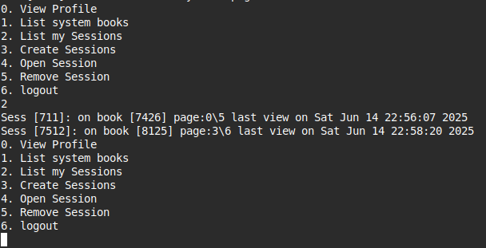

# BookStore

C++ console-based app for managing a book store.

## Overview

In this system, there are two types of users who can log in/sign up: _admin_ users and _customer_ users.

The system supports **parallel access**.

### Admin User

An admin can:

- View their profile
- Add/delete/list system books
- Logout

### Customer User

A customer can:

- View their profile
- Create reading sessions
- List their current reading sessions
- Open a session
- Remove a session
- List current system books
- Logout

A customer reads one book at a time but maintains a history of sessions. Each session for a book keeps track of the last read page and the date of last reading.

During an open session:

- The customer can view the current page of the book
- Navigate to the next/previous page or jump to a specific one
- Close the session

## Screenshots

### user creation


### session list



## Run

```bash
git clone git@gitlab.com:madany/bookstore.git
cd bookstore

g++ --std=c++20 -o run.out src/main.cpp
./run.out
```
